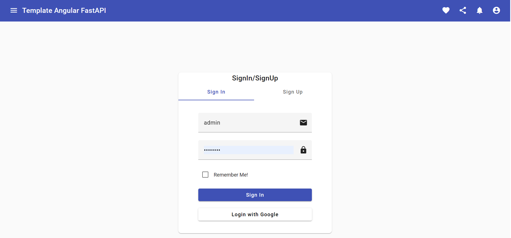

## Repository Name: StarterKit-Angular-FastAPI-Material

### Description

Welcome to the StarterKit-Angular-FastAPI-Material repository, your ultimate starting point for developing scalable and robust web projects. This repository integrates modern technologies including Angular, Formly.dev, Material Design for Angular, Python with FastAPI, and PostgreSQL as the relational database, providing a comprehensive foundation for your web development endeavors.

### Key Features

1. **Angular:** A frontend development framework offering a modular structure for building dynamic and responsive user interfaces.
   
2. **Formly.dev:** Simplifies form creation in Angular with a clean, declarative syntax and built-in validation features.
   
3. **Material Design for Angular:** Utilizes Material Design components specifically tailored for Angular, facilitating the creation of visually appealing and consistent user interfaces.
   
4. **FastAPI:** An efficient Python library for building asynchronous web APIs, offering high performance and seamless integration with Angular through native JSON support.
   
5. **Python:** A versatile and powerful programming language used for backend development, known for its readability and ease of maintenance.
   
6. **PostgreSQL:** A robust relational database solution ensuring data integrity and transactional consistency for storing project data.

### Repository Structure

- **dxweb/:** Contains the source code of the Angular frontend.
  
- **dxbackend/:** Includes the codebase for the FastAPI backend developed in Python.
  
- **database/:** Houses scripts and configurations related to the PostgreSQL database.
  
- **docs/:** Provides comprehensive documentation for getting started with the StarterKit and integrating additional features.
  
- **LICENSE:** Open-source license defining the terms of code usage within the repository.
  
- **README.md:** Primary documentation file offering an overview of the project, installation instructions, and useful links for developers.

Begin your journey in building powerful and scalable web applications today with the StarterKit Angular-FastAPI-Material repository!


### Running the Backend (FastAPI):
Install Dependencies:
Ensure you have Python and pip installed on your system. Then, install FastAPI and Uvicorn (an ASGI server) using pip if you haven't already:

```bash
pip install fastapi uvicorn
```

### Setup the Backend:

Create your backend using FastAPI. You can follow the example I provided earlier to create a Python file named main.py that defines routes and backend logic.
Run the Backend Server:

From the terminal, navigate to the directory where your main.py file is located.
Run the following command to start the server:

```bash
uvicorn main:app --reload
```

### Install Angular CLI:
Make sure you have Node.js and npm installed on your system. Then, install Angular CLI globally if you haven't already:

```bash
npm install -g @angular/cli
```

### Setup the Frontend:

Navigate to your Angular project directory.
Run the following command to start the development server:

```bash
ng serve --open
```

This will automatically open your app in the default browser. If it doesn't open automatically, you can access it at http://localhost:4200.
Interacting with the Project:
Once both servers are running (the backend on one port, e.g., 8000, and the frontend on another port, e.g., 4200), you can interact with your application by accessing the URL of the frontend server in your browser.
The frontend will interact with the backend via HTTP requests to the routes defined in your FastAPI server, enabling the full functionality of your application.
I hope these steps help you successfully run your project! If you encounter any issues, feel free to ask.

<p align="center">
  
</p>
<p align="center">
  
</p>
<p align="center">
  
</p>
<p align="center">
  
</p>


